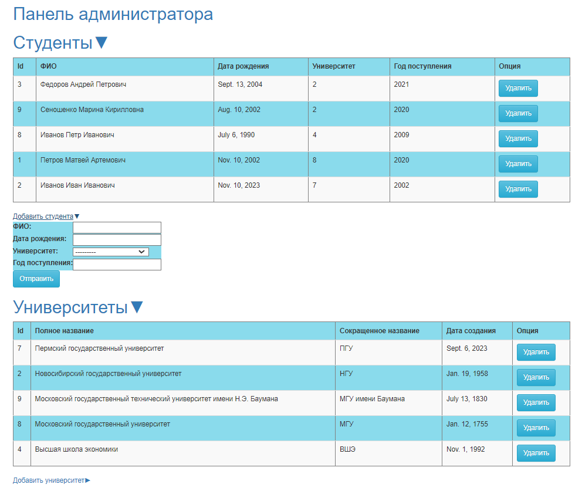

This site provides full CRUD(GET, POST, PUT, DELETE) to the entities student and university.

This is how the main page of the site looks like:



## How to launch it

Go to project folder, using terminal. Then type
```
cd university_system
python manage.py runserver
```
